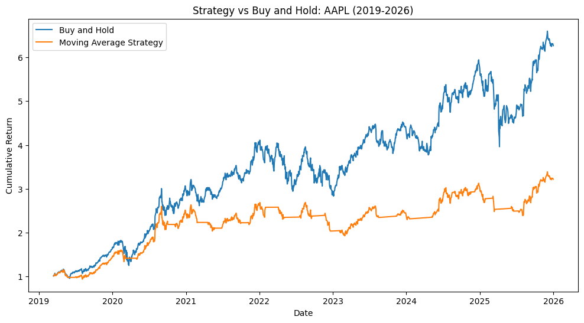
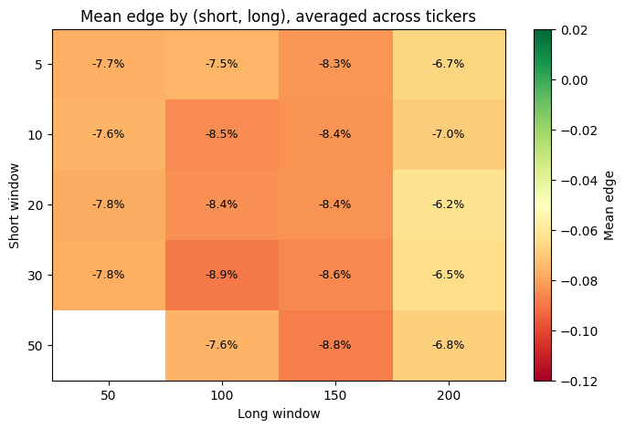

# Moving Average Crossover Backtest: AAPL and a 29-Ticker Sweep

Python backtest comparing a 20/50-day moving average crossover strategy to buy-and-hold, starting on AAPL and then testing whether that result holds up across 29 tickers and 19 parameter combinations, with realistic transaction costs, actual historical risk-free rates, and risk-adjusted performance metrics.

## What this is

This project started by testing a simple trend-following strategy against AAPL stock data from 2019 to 2026, comparing it to just buying and holding the stock. The strategy generates a buy signal when a short-term moving average crosses above a long-term moving average, and a sell signal when it crosses below.

One stock and one parameter pair isn't enough to draw a real conclusion from, so v2 adds a sweep: the same strategy run across 29 tickers spanning eight sectors and 19 short/long window combinations each, to check whether the AAPL result is a general property of this kind of strategy or just AAPL's particular price path.

## Result

### AAPL, 20/50 — the original test

| | CAGR | Max Drawdown | Sharpe |
|---|---|---|---|
| Buy & Hold | 31.06% | -33.36% | 0.94 |
| Strategy | 18.81% | -28.36% | 0.78 |

Buy-and-hold outperformed the strategy on both raw and risk-adjusted returns. The strategy made 18 round-trip trades over the period, spending about 65% of the time in the market. Transaction costs accounted for roughly 1.8% of cumulative return — verified directly in the notebook by comparing results with and without costs — so the underperformance is mainly about missed time in the market during recoveries, not trading fees.

Numbers reflect a run against live yfinance data on 09/02/2026. Re-running later may produce slightly different results if the underlying price data or T-bill rate series is revised.

### The sweep — is AAPL representative?

Turns out this AAPL result wasn't a fluke of that one stock. Across the full sweep (29 tickers × 19 short/long combinations = 551 cells):

- The strategy beat buy-and-hold on CAGR in only **7.3%** of cells, and on Sharpe in **9.4%**.
- AAPL's own 20/50 result sits at roughly the **18th percentile** of the edge distribution — worse than most cells in the sweep, not a lucky or unusually bad draw.
- A 95% bootstrap confidence interval on mean edge across tickers comes out to roughly **-9.4% to -6.2%**, entirely below zero.
- Boeing (BA) is the one real exception, beating buy-and-hold in 63% of its parameter combinations — plausibly because it spent much of this window in extended drawdowns rather than a clean uptrend, which is closer to the kind of choppy price path trend-following is supposed to help with. Every other ticker, AAPL included, loses in the large majority of its combinations, and 20 of the 29 tickers never beat buy-and-hold in a single one of their 19 combinations.

So over 2019-2026, in this ticker universe, the strategy isn't just weak on AAPL — it's weak almost everywhere tested. See `2_Sweep_Analysis.ipynb` for the full breakdown, distribution plots, the parameter heatmap, and the per-ticker win rates.

## A caveat on the sweep universe: survivorship bias

The 29 tickers in the sweep are today's liquid, still-listed large caps (see `sweep.py` for the list). Anything that was delisted, went bankrupt, or got acquired during 2019-2026 isn't in this universe, so it skews toward "the market's winners" rather than a neutral cross-section of everything that existed in 2019. Every ticker is also tested over the exact same 2019-2026 window, which was a strong bull run for large-cap US equities generally. Treat the sweep's numbers as an upper bound on how well this strategy could have done, not a clean, unbiased estimate — and treat "the strategy loses in this universe, in this window" as the actual finding, not "the strategy loses, full stop."

## What I did

- Pulled daily price data and the 13-week T-bill rate from yfinance, caching both to `data/` so re-running doesn't mean re-downloading every time
- Calculated short/long moving averages and built buy/sell signals from their crossover
- Used the actual historical T-bill rate for idle cash instead of assuming 0% or a flat guess
- Charged a small transaction cost on every trade instead of assuming free trading
- Extracted the backtest logic into `backtest.py` as reusable functions (`load_prices`, `load_risk_free`, `backtest`, `max_drawdown`, `cagr`, `sharpe`, `summarize`, `trade_stats`), so the AAPL notebook and the sweep run the exact same logic instead of two separate implementations that could quietly drift apart
- Ran that same backtest across 29 tickers and 19 short/long combinations each, to check whether the AAPL finding generalizes
- Added a sanity check comparing the implied cost drag against the expected drag from the trade count, to verify the transaction cost logic was actually correct rather than just trusting the output
- Used a ticker-level bootstrap (not a cell-level one) for the sweep's confidence interval, since the 19 parameter combinations for one ticker are run on the same price series and are heavily correlated with each other — treating each of the 551 rows as an independent sample would have understated the real uncertainty

## Assumptions and limitations

- Long/flat only — no short positions
- Full capital committed on every trade, no partial position sizing
- Fills happen at the closing price of the signal day, not the next day's open
- Cash return while out of the market uses the actual historical T-bill rate where available, falling back to a flat 4% estimate if that data can't be pulled
- Prices and T-bill rates are cached to `data/` on first download; delete the cache or pass `refresh=True` to `load_prices`/`load_risk_free` to pull fresh data
- Sweep universe has survivorship bias and is tested over a single historical window — see the caveat above

## File layout

- `backtest.py` — the reusable backtest module (data loading/caching, the strategy itself, and the performance metrics)
- `archive_original_v1.ipynb` — the original AAPL-only notebook, unchanged
- `1_AAPL_Backtest.ipynb` — the same AAPL result, reproduced using `backtest.py` instead of one-off cells
- `sweep.py` — runs the strategy across the 29-ticker × 19-parameter grid and writes `results/sweep_results.csv`
- `results/sweep_results.csv` — one row per (ticker, short, long) cell: CAGR, Sharpe, max drawdown, and edge for strategy vs. buy-and-hold, plus trade stats
- `2_Sweep_Analysis.ipynb` — reads the sweep results and reports the headline numbers, distribution, parameter heatmap, and per-ticker win rates
- `data/` — cached price and T-bill CSVs, created on first run

## How to run

1. Clone this repo
2. Install dependencies: `pip install -r requirements.txt`
3. Open `1_AAPL_Backtest.ipynb` and run all cells for the AAPL-only result (or `archive_original_v1.ipynb` for the original, unrefactored version)
4. Run `python sweep.py` to regenerate `results/sweep_results.csv` — this downloads 29 tickers plus the T-bill rate on first run (a couple of minutes), caching to `data/` so later runs are fast
5. Open `2_Sweep_Analysis.ipynb` and run all cells to see the sweep results

## Tools

yfinance, pandas, NumPy, Matplotlib

## What's next

- **Walk-forward validation:** the 20/50 windows — and every window in the sweep — were picked once and tested on the full history. A more honest test would pick parameters using only past data at each point in time and test forward from there, so results aren't quietly benefiting from hindsight. This is the next planned step.
- **Multiple-testing correction:** with 551 cells tested, some combinations look good just by chance — Boeing's result should be read with that in mind, not treated as a real edge until it's checked more carefully.
- **Multiple signals combined:** adding something like RSI sounds like it should help, but it also adds more free parameters, and technical indicators tend to be pretty correlated with each other anyway. The real question is whether it adds anything once the extra parameters are accounted for.
- **Position sizing:** right now the strategy is either fully in or fully out. A more advanced version might scale position size based on signal strength or volatility, rather than a hard on/off switch.
- **A survivorship-bias-free universe:** the current sweep only includes tickers that are still liquid and listed today. Testing against a point-in-time universe (including delisted/acquired names) would remove that bias, but needs data this project doesn't currently have.
- **Machine learning based signals:** with a few thousand daily observations across 29 correlated large-cap stocks, there isn't a lot of independent signal to learn from compared to noise. A flexible model would probably overfit before it actually learned anything useful. If ML shows up here at all, it'd make more sense as a way to combine a few existing signals together under strict walk-forward validation, not as something trying to find patterns directly in raw price data.
